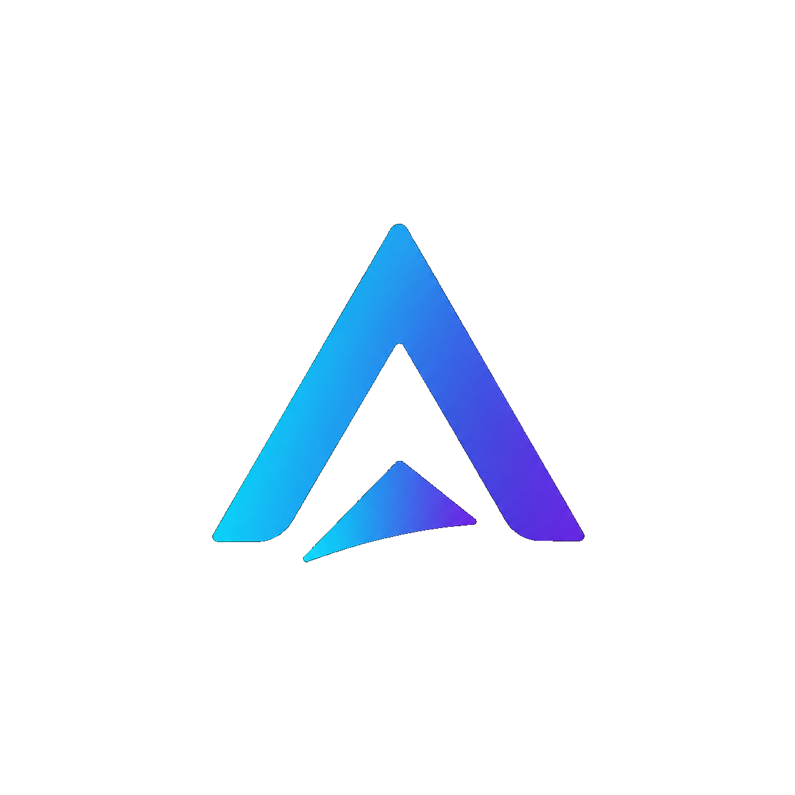

# Aegis AI — Autonomous Enterprise Operations Platform

<div align="center">
  
</div>

> **An AI-powered autonomous operations platform that detects, diagnoses, and remediates production incidents across distributed systems — with durable workflows, multi-agent orchestration, human approval, safety controls, observability, and objective evaluation.**

## What is Aegis AI?

Aegis AI is an **AI-SRE platform** designed to act as an intelligent operations engineer for modern distributed systems.

Instead of building another chatbot or RAG application, Aegis connects directly to a monitored software environment, observes its health, detects operational problems, investigates their root causes, recommends or executes remediation actions, verifies the outcome, and produces a complete incident record.

The goal is to build an **engineering-grade autonomous operations system**, not an AI demo.

---

## The Problem

Modern production systems are composed of multiple services:

```text
Orders
   ↓
Payments
   ↓
Inventory
   ↓
Notifications
   ↓
Databases / External APIs
```

A failure in one service can create a chain reaction across the entire system.

For example:

```text
Payment Service
      ↓
Database connection exhaustion
      ↓
Payment failures
      ↓
Order failures
      ↓
Notification delays
      ↓
Customer impact
```

Traditional monitoring systems can tell engineers:

> "Something is wrong."

Aegis attempts to answer:

> **What happened? Why did it happen? What should we do? Is it safe to do automatically? Did the remediation actually work?**

---

# Core Architecture

Aegis consists of two major systems.

## 1. Target System

A realistic distributed application that Aegis monitors.

Example:

```text
                    ┌──────────────────┐
                    │   API Gateway    │
                    └────────┬─────────┘
                             │
             ┌───────────────┼───────────────┐
             ↓               ↓               ↓
        Orders Service   Payment Service   Inventory
             │               │               │
             └───────────────┼───────────────┘
                             ↓
                         PostgreSQL
```

The target system contains intentionally injectable failures such as:

* Database connection exhaustion
* Service crashes
* Memory leaks
* CPU saturation
* High latency
* Rate-limit exhaustion
* Dependency failures
* Cascading failures
* Incorrect deployments

This gives Aegis a real environment to observe and repair.

---

# 2. Aegis AI Platform

The platform observes the target system and manages incidents.

```text
                  Production System
                         │
                         ↓
               Metrics / Logs / Traces
                         │
                         ↓
                  Aegis Detection
                         │
                         ↓
                  Incident Created
                         │
                         ↓
                 Triage Agent
                         │
                         ↓
               Diagnosis Agent
                         │
                         ↓
              Root Cause Hypothesis
                         │
                         ↓
             Remediation Agent
                         │
                ┌────────┴────────┐
                ↓                 ↓
          Safe Action       Dangerous Action
                │                 │
                ↓                 ↓
          Auto Execute      Human Approval
                                  │
                                  ↓
                             Execute
                                  │
                                  ↓
                           Verify Result
                                  │
                                  ↓
                         Incident Resolved
                                  │
                                  ↓
                         Postmortem Report
```

---

# Multi-Agent System

Aegis uses specialized agents instead of a single general-purpose agent.

## Triage Agent

Responsible for:

* Alert classification
* Severity estimation
* Incident prioritization
* Initial impact analysis
* Determining whether deeper investigation is required

---

## Diagnosis Agent

Responsible for investigating the incident.

It can interact with operational tools such as:

```text
query_metrics()
search_logs()
get_trace()
inspect_service()
get_recent_deployments()
check_dependencies()
```

It builds hypotheses about the root cause and gathers evidence before making a conclusion.

---

## Remediation Agent

Responsible for selecting an appropriate remediation strategy.

Potential actions include:

```text
restart_service()
rollback_deployment()
scale_service()
disable_feature()
clear_connection_pool()
```

Actions are governed by safety policies.

Low-risk operations may execute automatically.

High-risk or destructive operations require human approval.

---

## Verification Agent

After remediation, the system does not simply assume success.

It verifies:

* Error rate
* Latency
* Service health
* Dependency health
* Resource utilization
* Incident state

If the system is still unhealthy, the workflow can continue investigating or execute a fallback strategy.

---

## Postmortem Agent

After an incident is resolved, Aegis generates a structured incident report containing:

* Incident summary
* Timeline
* Impact
* Root cause
* Evidence
* Actions performed
* Remediation result
* Contributing factors
* Recommendations
* Prevention strategies

---

# Durable Execution with Temporal

Temporal is used as the workflow orchestration layer.

An incident becomes a durable workflow:

```text
Incident Workflow
       │
       ├── Triage
       │
       ├── Diagnosis
       │
       ├── Remediation
       │
       ├── Verification
       │
       └── Postmortem
```

The workflow supports:

* Retries
* Timeouts
* Long-running execution
* Signals
* Human approval
* Workflow recovery
* Failure handling
* Compensation
* Saga-style rollback

This allows an incident workflow to survive application crashes or infrastructure failures without losing its state.

---

# Safety & Guardrails

Aegis is designed around the principle:

> **An AI agent should not be trusted simply because an LLM generated an action.**

Every remediation action passes through safety controls.

Example:

```text
Agent proposes action
        ↓
Policy Engine
        ↓
Risk Classification
        ↓
     ┌──┴──┐
     ↓     ↓
   Safe   Risky
     ↓     ↓
 Execute  Approval
           ↓
       Human Review
           ↓
         Execute
```

Safety mechanisms include:

* Action allowlists
* Risk classification
* Permission boundaries
* Human-in-the-loop approval
* Rate limits
* Execution timeouts
* Rollback strategies
* Audit logs
* Idempotent actions
* Blast-radius controls

---

# Observability

Aegis itself is observable.

The platform integrates operational telemetry including:

* Metrics
* Logs
* Distributed traces
* Workflow events
* Agent decisions
* Tool calls
* Remediation actions
* Model latency
* Model usage
* Token consumption
* Errors

Planned observability stack:

```text
OpenTelemetry
      │
      ├── Metrics → Prometheus
      │
      ├── Traces
      │
      └── Logs
             ↓
          Grafana
```

---

# Chaos Engineering

Aegis includes a failure-injection system to evaluate whether the platform can actually handle incidents.

Example:

```text
Inject Failure
      ↓
System Degrades
      ↓
Alert Generated
      ↓
Aegis Detects
      ↓
Aegis Diagnoses
      ↓
Aegis Remediates
      ↓
System Recovers
```

Example failure scenarios:

```text
Scenario 1
Database latency ↑

Scenario 2
Payment service crashes

Scenario 3
Memory leak

Scenario 4
CPU saturation

Scenario 5
Rate limit exhaustion

Scenario 6
Cascading service failure
```

---

# Objective Evaluation

Aegis is evaluated using measurable engineering metrics rather than subjective demonstrations.

Key metrics include:

### Time To Detect

```text
TTD = Detection Time - Failure Injection Time
```

### Time To Remediate

```text
TTR = Recovery Time - Failure Detection Time
```

### Root Cause Accuracy

Percentage of incidents where Aegis identifies the correct root cause.

### Remediation Success Rate

Percentage of remediation attempts that successfully restore system health.

### False Positive Rate

How frequently Aegis incorrectly declares an incident.

### Unsafe Action Rate

How frequently the system proposes or executes an action violating safety policies.

### Recovery Rate

Percentage of injected failures successfully recovered.

These metrics create a reproducible evaluation framework for the autonomous system.

---

# Intelligent Model Routing

Not every operational problem requires the most expensive model.

Aegis can route tasks based on complexity:

```text
Incident
   ↓
Triage
   ↓
Cheap / Fast Model
   ↓
Simple?
 ┌─┴─┐
Yes  No
 ↓    ↓
Done  Stronger Model
      ↓
   Diagnosis
```

This allows optimization of:

* Cost
* Latency
* Model quality
* Reliability

---

# Backend Engineering

Aegis is designed as a real backend system.

Core technologies include:

* Python
* FastAPI
* PostgreSQL
* SQLAlchemy
* Alembic
* Docker
* Temporal
* Redis / messaging infrastructure where required
* OpenTelemetry
* Prometheus
* Grafana

The backend follows clear separation between:

```text
API
↓
Domain
↓
Services
↓
Repositories
↓
Database
```

---

# Incident Management

The platform maintains a persistent incident lifecycle.

Example:

```text
DETECTED
   ↓
TRIAGING
   ↓
INVESTIGATING
   ↓
AWAITING_APPROVAL
   ↓
REMEDIATING
   ↓
VERIFYING
   ↓
RESOLVED
```

Every transition is recorded as an event.

This creates a complete audit trail of what happened and why.

---

# Human-in-the-Loop

Aegis is not designed as a blindly autonomous system.

Humans remain in control of high-risk actions.

Example:

```text
Aegis:
"Rollback payment-service to deployment v42?"

Risk:
HIGH

Reason:
Current deployment is causing 78% payment failures.

Evidence:
- Error rate: 78%
- Latency: +430%
- Deployment occurred 4 minutes ago

[Approve] [Reject]
```

The approval becomes a workflow signal and the Temporal workflow continues from the appropriate state.

---

# Security

Security is treated as part of the architecture rather than an afterthought.

Areas include:

* Authentication
* Authorization
* RBAC
* Service identity
* Secrets management
* API security
* Audit logging
* Action permissions
* Tenant isolation
* Least-privilege execution

---

# Multi-Tenant Architecture

Aegis is designed with enterprise deployment in mind.

Different organizations can monitor their own infrastructure while maintaining logical isolation.

```text
Aegis
│
├── Organization A
│   ├── Services
│   ├── Incidents
│   └── Agents
│
├── Organization B
│   ├── Services
│   ├── Incidents
│   └── Agents
│
└── Organization C
    ├── Services
    ├── Incidents
    └── Agents
```

---

# Tool-Based Agent Architecture

Agents interact with the environment through controlled tools instead of directly accessing infrastructure.

Example:

```text
Agent
  │
  ├── Metrics Tool
  ├── Logs Tool
  ├── Tracing Tool
  ├── Deployment Tool
  ├── Kubernetes Tool
  ├── Service Health Tool
  └── Remediation Tool
```

Every tool call can be:

* Validated
* Authorized
* Logged
* Rate-limited
* Evaluated
* Rejected by policy

---

# Auditability

Every important operation is recorded.

Example:

```text
Incident #INC-1042

12:04:11  Alert received
12:04:12  Triage started
12:04:15  Diagnosis started
12:04:21  Logs queried
12:04:25  Metrics queried
12:04:31  Root cause identified
12:04:34  Rollback proposed
12:04:35  Human approval requested
12:05:02  Approval received
12:05:04  Rollback executed
12:05:19  Health verified
12:05:20  Incident resolved
```

This makes the system explainable and auditable.

---

# Project Development Roadmap

The project is developed incrementally.

### Phase 1 — Backend Foundation

* FastAPI
* Configuration
* PostgreSQL
* SQLAlchemy
* Alembic
* Domain models
* API architecture

### Phase 2 — Incident Management

* Incident lifecycle
* Event system
* Incident APIs
* Persistent state
* Audit trail

### Phase 3 — Target Distributed System

* Microservices
* Service dependencies
* Failure injection
* Deployment simulation

### Phase 4 — Observability

* OpenTelemetry
* Metrics
* Logs
* Traces
* Prometheus
* Grafana

### Phase 5 — Temporal

* Durable workflows
* Retries
* Timeouts
* Signals
* Human approval
* Compensation

### Phase 6 — AI Agents

* Triage Agent
* Diagnosis Agent
* Remediation Agent
* Verification Agent
* Postmortem Agent

### Phase 7 — Safety

* Guardrails
* Policy engine
* Risk scoring
* Permission system
* Human approval

### Phase 8 — Evaluation

* Chaos scenarios
* Ground truth
* Automated evaluation
* TTD
* TTR
* Root cause accuracy
* Remediation success

### Phase 9 — Production Engineering

* Authentication
* RBAC
* Multi-tenancy
* Rate limiting
* Observability
* Security
* Cost optimization

### Phase 10 — User Interface

The final platform provides an operations dashboard where engineers can:

* View incidents
* Inspect system health
* Follow agent reasoning/evidence
* Approve or reject actions
* Inspect traces
* Review remediation history
* Compare evaluation results
* Read postmortems

---

# Project Goal

Aegis AI is intended to demonstrate the engineering skills required to build modern AI-powered production systems.

The project combines:

```text
Software Engineering
        +
Backend Engineering
        +
Distributed Systems
        +
AI Agents
        +
LLM Engineering
        +
Workflow Orchestration
        +
Observability
        +
Security
        +
Safety
        +
Evaluation
        +
DevOps
```

The objective is not to demonstrate that an LLM can generate text.

The objective is to demonstrate that an AI system can **operate reliably inside a real software environment, make evidence-based decisions, execute controlled actions, recover from failures, and prove whether its actions worked.**

---

## Status

**Currently in active development**

Current foundation:

* FastAPI backend
* Dedicated Python environment
* PostgreSQL
* Async SQLAlchemy
* `Incident` domain model
* Initial incident API
* Alembic migration infrastructure

More components are being implemented incrementally.

---

## Philosophy

> **Don't build an AI demo. Build an AI system.**

Aegis is designed around production engineering principles:

**Reliable. Observable. Evaluated. Secure. Auditable. Recoverable.**

---
