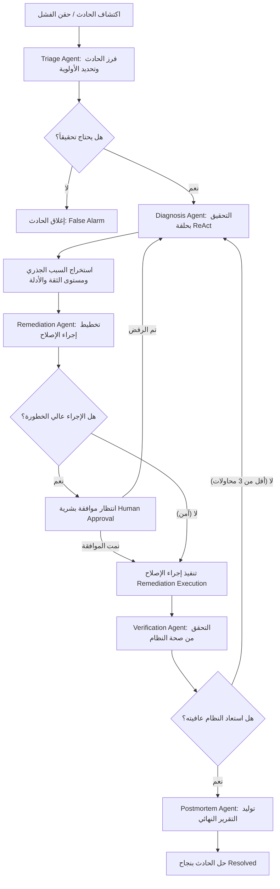

# دليل شامل وتفصيلي: معمارية Aegis AI ونظام الوكلاء الأذكياء (Multi-Agent SRE Platform)

---

## 1. ما هو مشروع Aegis AI؟ ولماذا قمنا ببنائه؟

في بيئات الإنتاج الحديثة (Production Environments)، تتكون الأنظمة من عشرات أو مئات الخدمات المصغرة المترابطة (Microservices):

```text
API Gateway ───► Orders Service ───► Payment Service ───► PostgreSQL
                        │                    │
                        ▼                    ▼
                Inventory Service    Notification Service
```

إذا حدث خلل في خدمة واحدة — على سبيل المثال: امتلاء تجمع الاتصالات بقاعدة البيانات (**Database Connection Exhaustion**) في `Payment Service` — فإن هذا العطل لا يتوقف عندها، بل ينتقل كأثر الدومينو (**Cascading Failure**):
1. خدمة الدفع تتوقف عن الاستجابة.
2. خدمة الطلبات تتكدس فيها الطوابير وتفشل.
3. بوابة النظام (API Gateway) تبدأ في إرجاع أخطاء `504 Gateway Timeout`.
4. يتوقف الموقع بالكامل عن استقبال طلبات الشراء.

### الفرق بين أدوات المراقبة التقليدية و Aegis:
- **أدوات المراقبة التقليدية (Prometheus / Datadog / Grafana):** تكتفي بإطلاق إنذار مفاده: *"هناك خطأ ما! معدل الخطأ ارتفع إلى 90%"*، وتترك مهندس العمليات (SRE) يستيقظ في منتصف الليل ليبحث في السجلات والمقاييس يدوياً.
- **منصة Aegis AI:** هي مهندس عمليات ذكي ومستقل (**Autonomous AI-SRE Platform**). لا تكتفي بالإشعار، بل:
  1. ترصد العطل فور وقوعه.
  2. تفرز الحادث وتحدد خطورته وأولويته (**Triage**).
  3. تحقق بعمق وتستخدم أدوات حية لاكتشاف السبب الجذري مع الأدلة (**Diagnosis**).
  4. تضع خطة علاج وتحدد درجة خطورتها (**Remediation Planning**).
  5. تنفذ الإصلاح تلقائياً إن كان آمناً، أو تطلب موافقة بشرية إن كان عالي الخطورة (**Human-in-the-Loop**).
  6. تتحقق عملياً بعد الإصلاح من أن النظام تعافى بالكامل (**Verification**).
  7. تصيغ تقريراً شاملاً للحادث وتوصيات وقائية لمنع تكراره (**Postmortem**).

---

## 2. المخطط العام لدورة حياة الحادث (Incident Lifecycle Architecture)

كل حادث يدخل في خط سير عمل متين ومحكوم عبر محرك سير العمل الدائم (**Temporal Engine**):



---

## 3. طبقة نماذج الذكاء الاصطناعي (LLM Abstraction Layer)

توجد هذه الطبقة داخل المجلد `apps/agents/llm/`، وهدفها الأساسي هو **فصل منطق الوكلاء البرمجي تماماً عن أي مزود ذكاء اصطناعي محدد**، مما يتيح التبديل بسلاسة بين النماذج المحلية المجانية (Ollama) والنماذج السحابية (OpenAI GPT-4o) دون تغيير سطر واحد في كود الوكلاء.

### 3.1 الكائنات وهياكل البيانات الأساسية ([base.py](file:///d:/Aegis/apps/agents/llm/base.py))
1. **`ToolCall`**:
   يمثل استدعاء لأداة يطلبه نموذج اللغة.
   - `id`: المعرف الفريد للاستدعاء.
   - `name`: اسم الأداة المطلوب تشغيلها (مثل `query_metrics`).
   - `arguments`: المعاملات والمدخلات التي حددها النموذج بصيغة قاموس (Dictionary).
2. **`TokenUsage`**:
   لتتبع استهلاك الرموز (Tokens) بدقة لحساب التكلفة ومنع تجاوز الميزانية المحددة للوكيل:
   - `prompt_tokens`, `completion_tokens`, `total_tokens`.
3. **`Message`**:
   يمثل رسالة واحدة في سجل المحادثة للوكيل، ويدعم الأدوار الأربعة القياسية:
   - `system`: هوية الوكيل وتعليماته.
   - `user`: سياق التحقيق أو المشكلة.
   - `assistant`: إجابة النموذج (سواء كانت نصاً أو طلباً لاستدعاء أدوات).
   - `tool`: نتيجة تشغيل الأداة المرجعة للنموذج (مرتبطة بـ `tool_call_id`).
4. **`LLMResponse`**:
   الناتج الموحد من أي مزود LLM:
   - `content`: نص الإجابة (إذا انتهى النموذج من التفكير).
   - `tool_calls`: قائمة استدعاءات الأدوات (إذا قرر النموذج طلب معلومات إضافية).
   - `usage`: الرموز المستهلكة.
   - `finish_reason`: سبب التوقف (`stop` أو `tool_calls`).

### 3.2 العميل المحلي المجاني ([ollama_client.py](file:///d:/Aegis/apps/agents/llm/ollama_client.py))
- تم بناء `OllamaClient` ليرتبط بـ Ollama محلياً عبر `http://localhost:11434` باستخدام مكتبة `ollama.AsyncClient`.
- النموذج الافتراضي المعتمد هو **`llama3.2`** الذي يدعم استدعاء الدوال (Native Function Calling) بكفاءة عالية وبدون أي تكاليف مادية إطلاقاً.
- يتولى العميل ترجمة كائنات `Message` و `ToolDefinition` إلى النسق الذي يفهمه Ollama، ثم يعيد تحويل استجابة Ollama إلى كائن `LLMResponse` موحد.

### 3.3 العميل السحابي ([openai_client.py](file:///d:/Aegis/apps/agents/llm/openai_client.py))
- تم بناء `OpenAIClient` للربط مع OpenAI API للاستخدام في بيئات الإنتاج السحابية (يدعم `gpt-4o` للمهام المعقدة و `gpt-4o-mini` للمهام السريعة).

### 3.4 موجه النماذج الذكي ([router.py](file:///d:/Aegis/apps/agents/llm/router.py))
- يحتوي على جدول توجيه (`ROUTING_TABLE`) يربط كل مهمة بنموذج معين:
  - الفرز السريع (`triage`)
  - التشخيص الدقيق (`diagnosis`)
  - التخطيط للإصلاح (`remediation`)
  - التحقق (`verification`)
  - كتابة التقرير (`postmortem`)
- يوفر الدالة `get_llm_client(task, model)` لإرجاع العميل المناسب تلقائياً.

---

## 4. محرك الوكيل الأساسي وحلقة ReAct ([base.py](file:///d:/Aegis/apps/agents/base.py))

تم بناء جميع الوكلاء استناداً إلى النمط العالمي **ReAct (Reason → Act → Observe)**:

```text
       ┌────────────────────────────────────────────────────────┐
       │                       ReAct Loop                       │
       │                                                        │
       │   1. فكر (Reason): النموذج يحلل المدخلات وسجل الرسائل. │
       │   2. تصرف (Act): يطلب استدعاء أداة لمعرفة معلومة ما.   │
       │   3. راقب (Observe): تُنفذ الأداة وتُعاد النتيجة له.  │
       │   4. كرر حتى يصل الوكيل للقرار النهائي ويُرجع JSON.   │
       └────────────────────────────────────────────────────────┘
```

### آليات الحماية والأمان في الكلاس `BaseAgent`:
1. **ميزانية الرموز (`token_budget`)**:
   لكل وكيل ميزانية قصوى للرموز (مثلاً 8,000 توكن لوكيل التشخيص، و 4,000 توكن لوكيل الفرز). إذا تجاوز الوكيل الميزانية أثناء التفكير، يتوقف فوراً لمنع الحلقات اللانهائية وهدر الموارد.
2. **الحد الأقصى للخطوات (`max_steps`)**:
   لكل وكيل حد أقصى لعدد جولات الاستدعاء (مثلاً 10 خطوات للتشخيص، 5 خطوات للفرز). إذا وصل للحد الأقصى دون استنتاج، ينهي التحقيق بأمان مع توضيح السبب `max_steps_reached`.
3. **تتبع استدعاءات الأدوات (`ToolCallTrace`)**:
   يتم تسجيل كل أداة استدعاها الوكيل، مدخلاتها، والنتيجة التي رجعت منها، وفي أي خطوة، لتوثيق مسار التفكير بالكامل (Audit Trail).

---

## 5. سجل وأدوات الوكلاء (Tool Registry & Definitions)

توجد الأدوات داخل المجلد `apps/agents/tools/`.

### 5.1 سجل الأدوات المركزي ([registry.py](file:///d:/Aegis/apps/agents/tools/registry.py))
- **`ToolDefinition`**: تعريف كل أداة (اسمها، وصف دورها للنموذج، مخطط مدخلاتها بصيغة JSON Schema، والدالة البرمجية المنفذة `handler`).
- **`ToolResult`**: كائن النتيجة الموحد (`success`, `data`, `error`, `execution_time_ms`).
- **الأمان المطلق:** الأداة **لا ترفع أبداً أي استثناء (Exception)** يوقف التطبيق. إذا فشلت الأداة برمجياً أو لم تجد الخدمة، يُعاد الخطأ كنص داخل `ToolResult`، ليراه نموذج الذكاء الاصطناعي ويتعلم منه ويعيد المحاولة بطريقة أخرى!
- **حقن جلسة قاعدة البيانات تلقائياً:** إذا كانت الأداة تتطلب قاعدة بيانات (`requires_db=True`)، يقوم السجل بحقن `db_session` تلقائياً دون تدخل المطور.
- **توليد مخططات OpenAI:** الدالة `get_openai_schemas()` تقوم تلقائياً بتحويل جميع الأدوات المسجلة إلى الصيغة القياسية التي تفهمها نماذج LLM لاستدعاء الدوال.

### 5.2 مبدأ الصلاحيات الأقل (Principle of Least Privilege)
لا نمنح جميع الأدوات لجميع الوكلاء! كل وكيل يحصل فقط على الأدوات الضرورية لمهمته من خلال دوال المصنع (Factories) في [definitions.py](file:///d:/Aegis/apps/agents/tools/definitions.py):

| الأداة (Tool) | وظيفتها العملية | Triage | Diagnosis | Remediation | Verification | Postmortem |
| :--- | :--- | :---: | :---: | :---: | :---: | :---: |
| `query_metrics` | الاستعلام عن معدل الخطأ والكمون والذاكرة والمعالج | ✅ | ✅ | ✅ | ✅ | ❌ |
| `get_service_dependencies` | جلب شجرة التبعيات وحساب نطاق الضرر (Blast Radius) | ✅ | ✅ | ❌ | ❌ | ❌ |
| `get_active_failures` | جلب حالات الفشل المحقونة الحالية المؤكدة | ❌ | ✅ | ❌ | ✅ | ❌ |
| `search_logs` | البحث في سجلات الخدمة عن أخطاء الانهيار والمهلة | ❌ | ✅ | ❌ | ❌ | ❌ |
| `get_incident_history` | مراجعة تاريخ الحوادث السابقة لنفس الخدمة | ❌ | ✅ | ❌ | ❌ | ❌ |
| `check_system_health` | إعطاء نظرة شاملة (Bird's-eye view) لكافة خدمات النظام | ✅ | ✅ | ✅ | ✅ | ❌ |

---

## 6. تفصيل الوكلاء الخمسة المتخصصين (The 5 Specialized Agents)

تم تقسيم مهام إدارة الحادث إلى خمسة وكلاء مستقلين ومتخصصين، يركز كل منهم على جانب محدد بأعلى دقة:

---

### 6.1 وكيل الفرز السريع ([triage_agent.py](file:///d:/Aegis/apps/agents/triage_agent.py))

* **الهدف:** تقييم فوري لحجم الحادث وتحديد ما إذا كان يتطلب استنفاراً وتحقيقاً عميقاً أم أنه إنذار عابر أو طفيف.
* **الأدوات المتاحة:** `query_metrics`, `get_service_dependencies`, `check_system_health`.
* **الحد الأقصى للخطوات:** 5 خطوات | **ميزانية الرموز:** 4,000 توكن.
* **بروتوكول العمل:**
  1. يفحص مقاييس الخدمة المبلغ عنها.
  2. يقيم نطاق التأثير (Blast Radius) بالنظر في شجرة التبعيات.
  3. يحدد مستوى الخطورة (`critical`, `high`, `medium`, `low`).
  4. يحدد الأولوية من 1 (حرجة للغاية) إلى 4 (منخفضة).
  5. يقرر `should_investigate`: هل يحتاج النظام إلى بدء تحقيق كامل؟
* **هيكل المخرجات المنظم (`TriageOutput`):**
  ```python
  @dataclass
  class TriageOutput:
      severity: str              # "critical" | "high" | "medium" | "low"
      priority: int              # 1 إلى 4
      should_investigate: bool   # هل يبدأ التحقيق؟
      affected_services: list[str]
      summary: str
      raw_answer: str
  ```

---

### 6.2 وكيل التشخيص العميق ([diagnosis_agent.py](file:///d:/Aegis/apps/agents/diagnosis_agent.py))

* **الهدف:** المحقق الرئيسي للنظام. يقوم باكتشاف **السبب الجذري الحقيقي (Root Cause)** للعطل، وجمع الأدلة القاطعة من السجلات والمقاييس.
* **الأدوات المتاحة:** المجموعة الكاملة (6 أدوات: مقاييس، تبعيات، سجلات، تاريخ الحوادث، الفشل النشط، صحة النظام).
* **الحد الأقصى للخطوات:** 10 خطوات | **ميزانية الرموز:** 8,000 توكن.
* **بروتوكول العمل:**
  1. الاستعلام عن مقاييس الخدمة لاكتشاف نوع التدهور (ذاكرة، معالج، أخطاء شبكة).
  2. البحث في سجلات الأخطاء (`search_logs`) للعثور على استثناءات أو رسائل OOM أو مهلات الربط.
  3. فحص الفشل النشط للتأكد من مصدر المشكلة.
  4. دراسة تبعيات الخدمة للتأكد مما إذا كان السبب قادماً من خدمة سابقة (Upstream Dependency).
  5. تقدير نسبة الثقة بالتشخيص من `0.0` إلى `1.0` (الثقة > 0.8 تعني يقيناً تاماً).
* **هيكل المخرجات المنظم (`DiagnosisOutput`):**
  ```python
  @dataclass
  class DiagnosisOutput:
      root_cause: str                 # وصف واضح ومحدد للسبب الجذري
      failure_type: str               # نوع الفشل (مثل service_crash, memory_leak)
      confidence: float               # نسبة الثقة (مثلاً 0.95)
      affected_services: list[str]   # الخدمات المتضررة
      evidence: list[str]            # الأدلة الملموسة من السجلات والمقاييس
      recommended_actions: list[str] # إجراءات المعالجة المقترحة
  ```

---

### 6.3 وكيل تخطيط الإصلاح ([remediation_agent.py](file:///d:/Aegis/apps/agents/remediation_agent.py))

* **الهدف:** تحويل التشخيص إلى **خطة علاجية قابلة للتنفيذ**، مع تقييم درجة خطورة كل إجراء وتطبيق مبادئ السلامة التشغيلية.
* **الإجراءات المتاحة للاختيار:**
  - `restart_service`: إعادة تشغيل خدمة منهارة أو تعاني من تسريب ذاكرة (خطورة منخفضة - متوسطة).
  - `scale_service`: زيادة عدد النسخ (Replicas) لمواجهة الضغط العالي (خطورة متوسطة).
  - `restart_dependency`: إعادة تشغيل خدمة تابعة تؤثر على غيرها (خطورة عالية).
  - `clear_connection_pool`: إعادة ضبط تجمع اتصالات قاعدة البيانات (خطورة عالية - قد تسبب انقطاعاً لحظياً).
  - `rollback_deployment`: التراجع عن إصدار برمجي معيب (خطورة عالية).
* **معايير السلامة والموافقة البشرية:**
  - الإجراءات منخفضة المخاطر (`low`) والمتوسطة (`medium`): تُنفذ آلياً وفورياً لتسريع استعادة النظام.
  - الإجراءات عالية المخاطر (`high`): يُشترط فيها **إيقاف التنفيذ وطلب موافقة مهندس العمليات البشري (`requires_approval = True`)**.
* **هيكل المخرجات المنظم (`RemediationPlanOutput`):**
  ```python
  @dataclass
  class RemediationPlanOutput:
      action_type: str        # نوع الإجراء المختار
      target_service: str     # الخدمة المستهدفة
      risk_level: str         # "low" | "medium" | "high"
      requires_approval: bool # هل يلزم توقيع بشري؟
      parameters: dict        # معاملات الإجراء
      reason: str             # مبرر اختيار هذا الإجراء وهذا المستوى من الخطورة
  ```

---

### 6.4 وكيل التحقق من التعافي ([verification_agent.py](file:///d:/Aegis/apps/agents/verification_agent.py))

* **الهدف:** إغلاق حلقة التحكم بالتأكد الفعلي من نجاح الإصلاح وعدم الاكتفاء بالافتراض.
* **الأدوات المتاحة:** `query_metrics`, `check_system_health`, `get_active_failures`.
* **بروتوكول العمل:**
  1. الاستعلام مجدداً عن مقاييس الخدمة المستهدفة بعد تنفيذ العلاج.
  2. التأكد من انخفاض معدل الأخطاء وعودة زمن الاستجابة للمستويات الطبيعية.
  3. فحص عدم وجود أي حالات فشل متبقية (`remaining_failures == 0`).
  4. اتخاذ القرار: هل استعادت الخدمة عافيتها (`is_healthy: True`)؟ أم أن هناك حاجة لإعادة التحقيق مجدداً (`needs_reinvestigation: True`)؟
* **هيكل المخرجات المنظم (`VerificationOutput`):**
  ```python
  @dataclass
  class VerificationOutput:
      is_healthy: bool
      service_status: str             # "healthy" | "degraded" | "down"
      needs_reinvestigation: bool
      remaining_failures: int
      metrics_snapshot: dict
      details: str
  ```

---

### 6.5 وكيل كتابة التقرير النهائي ([postmortem_agent.py](file:///d:/Aegis/apps/agents/postmortem_agent.py))

* **الهدف:** صياغة تقرير هندسي شامل واحترافي خالٍ من اللوم الشخصي (**Blameless Postmortem Report**) يوثق الحادث من بدايته لنهايته.
* **طبيعة الوكيل:** هذا الوكيل **لا يحتاج إلى أدوات**، لأن سياق الحادث الكامل يُمرر إليه مباشرة (الجدول الزمني، مدة الحادث بالثواني، السبب الجذري، الإجراءات المتخذة، نسبة الثقة).
* **هيكل المخرجات المنظم (`PostmortemOutput`):**
  ```python
  @dataclass
  class PostmortemOutput:
      title: str                    # عنوان رسمي للتقرير مع التاريخ
      summary: str                  # ملخص تنفيذي لما حدث وتأثيره
      root_cause: str               # الشرح التقني الدقيق للسبب الجذري
      timeline: list[dict]          # الأحداث بالدقيقة والثانية
      actions_taken: list[str]      # القرارات والإصلاحات التي نُفذت
      impact: dict                  # حجم التأثير والخدمات المتأثرة
      recommendations: list[str]    # توصيات مستقبلية (مثل إضافة Circuit Breaker)
  ```

---

## 7. أوركسترا سير العمل المتين عبر Temporal (Temporal Durable Workflows)

توجد إدارة سير العمل داخل المجلد `apps/workflows/`.

### 7.1 لماذا نحتاج Temporal؟
إذا اعتمدنا على سكريبت Python عادي لتشغيل هؤلاء الوكلاء، فإن أي إعادة تشغيل للسيرفر أو انقطاع في الشبكة أو انهيار للحاوية (Container Crash) سيؤدي إلى ضياع حالة الحادث بالكامل وفقدان مسار التحقيق.
**Temporal يوفر التنفيذ المتين (Durable Execution):**
- إذا توقف السيرفر أثناء انتظار موافقة المهندس البشري، ثم عاد للعمل بعد ساعات، يستأنف سير العمل من نفس النقطة تماماً!
- كل خطوة تُنفذ كـ **Activity** مستقلة مسجلة في قاعدة بيانات Temporal.
- سياسات إعادة المحاولة الآلية (**Retry Policy**) مع زيادة الفواصل الزمنية تصاعدياً (Exponential Backoff).

### 7.2 تشريح سير العمل ([incident_workflow.py](file:///d:/Aegis/apps/workflows/incident_workflow.py))

```python
@workflow.defn
class IncidentResolutionWorkflow:
    ...
```

1. **المرحلة 1: الفرز (Triage Activity)**
   - تشغيل `activity_triage_incident`.
   - إذا قرر الوكيل أن الأمر لا يستدعي التحقيق (`should_investigate = False`)، يتم إغلاق الحادث فوراً مع تدوين السبب.

2. **حلقة التحقيق والإصلاح التكرارية (Investigation Loop)**
   - يدعم سير العمل حتى **3 محاولات لإعادة التحقيق** في حال فشل التحقق اللاحق:
     ```python
     for attempt in range(1, MAX_REINVESTIGATION_ATTEMPTS + 1):
         # تشخيص الحادث
         # تخطيط الإصلاح
         # فحص الحاجة للموافقة البشرية
         # تنفيذ الإصلاح
         # التحقق من التعافي
         if verification.is_healthy:
             break # نجح الإصلاح! ننتقل للتقرير
     ```

3. **آلية الموافقة البشرية (Human-in-the-Loop Signals & Queries)**
   - إذا كان الإجراء عالي المخاطر، يدخل سير العمل في حالة `awaiting_approval`:
     ```python
     await workflow.wait_condition(
         lambda: self._approval_status is not None,
         timeout=timedelta(minutes=30),
     )
     ```
   - يتلقى سير العمل إشارات خارجية (Temporal Signals):
     - `approve_remediation(reason)`: يوافق المهندس، فيكمل سير العمل التنفيذ.
     - `reject_remediation(reason)`: يرفض المهندس الإجراء، فيعود سير العمل تلقائياً للتشخيص لاقتراح خطة أخرى.
     - في حال مرور 30 دقيقة دون استجابة، تعتبر مهلة منتهية ويُرفض الإجراء تلقائياً حرصاً على سلامة النظام.

4. **المرحلة الأخيرة: التقرير (Postmortem Activity)**
   - حساب مدة الحادث بدقة بالثواني من واقع سجل الأحداث `IncidentEvent`.
   - توليد وحفظ التقرير النهائي وتحويل حالة الحادث في قاعدة البيانات إلى `resolved`.

### 7.3 حلقة الوصل في الأنشطة ([activities.py](file:///d:/Aegis/apps/workflows/activities.py))
كل نشاط (Activity) يقوم بـ:
1. فتح جلسة قاعدة بيانات غير متزامنة (`AsyncSession`).
2. تحديث حالة الحادث في جدول `incidents` وفقاً لمخطط الانتقالات المعتمد (`IncidentStatus`).
3. تشغيل الوكيل الذكي المعني بالخطوة وتزويده بالمعلومات.
4. تسجيل حدث تدقيق رسمي في جدول `incident_events` (مثل `triage_completed`, `diagnosis_completed`, `remediation_executed`).

---

## 8. محاكاة واختبار النظام الشامل ([test_agent_e2e.py](file:///d:/Aegis/test_agent_e2e.py))

تم بناء اختبار محاكاة شامل لاختبار وكيل التشخيص `DiagnosisAgent` وهو يعمل محلياً بالكامل على نموذج **Ollama (`llama3.2`)**:
- تم إنشاء أدوات وهمية (Mock Tools) تحاكي سيناريو انهيار كامل لخدمة المدفوعات:
  - مقاييس الخدمة ترجع: `status: down`, `memory: 95%`, `error_rate: 100%`.
  - السجلات ترجع رسائل: `Process exited with code 137 (OOM Killed)`.
  - التبعيات توضح أن تعطل `payment-service` يهدد بتعطيل `api-gateway` و `order-service`.
- أظهر الاختبار قدرة الوكيل على:
  1. استدعاء الأدوات بالترتيب الصحيح لمعاينة الكارثة.
  2. الربط بين رسائل نفاد الذاكرة في السجلات وبين انهيار الخدمة.
  3. استنتاج السبب الجذري بنسبة ثقة عالية وتقديم التوصيات المناسبة بصيغة JSON سليمة 100%.

---

## 9. ملخص هيكل الملفات المنجزة

| المسار | الوصف |
| :--- | :--- |
| [`apps/agents/base.py`](file:///d:/Aegis/apps/agents/base.py) | الكلاس الأساسي `BaseAgent` وحلقة التفكير ReAct مع ميزانية التوكنز والخطوات |
| [`apps/agents/triage_agent.py`](file:///d:/Aegis/apps/agents/triage_agent.py) | وكيل الفرز السريع وتحديد الخطورة والأولويات |
| [`apps/agents/diagnosis_agent.py`](file:///d:/Aegis/apps/agents/diagnosis_agent.py) | وكيل التشخيص العميق وجمع الأدلة وتحديد السبب الجذري |
| [`apps/agents/remediation_agent.py`](file:///d:/Aegis/apps/agents/remediation_agent.py) | وكيل تخطيط الإصلاح، تصنيف المخاطر، وفحص الموافقة البشرية |
| [`apps/agents/verification_agent.py`](file:///d:/Aegis/apps/agents/verification_agent.py) | وكيل التحقق بعد المعالجة وحلقة التغذية الراجعة |
| [`apps/agents/postmortem_agent.py`](file:///d:/Aegis/apps/agents/postmortem_agent.py) | وكيل كتابة التقارير الهندسية الشاملة والخالية من اللوم |
| [`apps/agents/llm/base.py`](file:///d:/Aegis/apps/agents/llm/base.py) | تجريد نماذج الذكاء الاصطناعي وكائنات الرسائل والأدوات |
| [`apps/agents/llm/ollama_client.py`](file:///d:/Aegis/apps/agents/llm/ollama_client.py) | عميل Ollama المحلي المجاني (Llama 3.2) مع دعم استدعاء الدوال |
| [`apps/agents/llm/openai_client.py`](file:///d:/Aegis/apps/agents/llm/openai_client.py) | عميل OpenAI السحابي مع تتبع الرموز |
| [`apps/agents/llm/router.py`](file:///d:/Aegis/apps/agents/llm/router.py) | توجيه المهام إلى النماذج المناسبة |
| [`apps/agents/tools/registry.py`](file:///d:/Aegis/apps/agents/tools/registry.py) | سجل الأدوات المركزي مع الحماية من الأخطاء وحقن الجلسات |
| [`apps/agents/tools/definitions.py`](file:///d:/Aegis/apps/agents/tools/definitions.py) | تطبيقات الأدوات الست ومصانع الأدوات لكل وكيل |
| [`apps/workflows/incident_workflow.py`](file:///d:/Aegis/apps/workflows/incident_workflow.py) | سير عمل Temporal الدائم مع الإشارات والموافقات وحلقات الإعادة |
| [`apps/workflows/activities.py`](file:///d:/Aegis/apps/workflows/activities.py) | أنشطة سير العمل التي تربط بين الوكلاء وقاعدة البيانات |
| [`test_agent_e2e.py`](file:///d:/Aegis/test_agent_e2e.py) | سيناريو المحاكاة والاختبار الشامل على Ollama Llama 3.2 |
